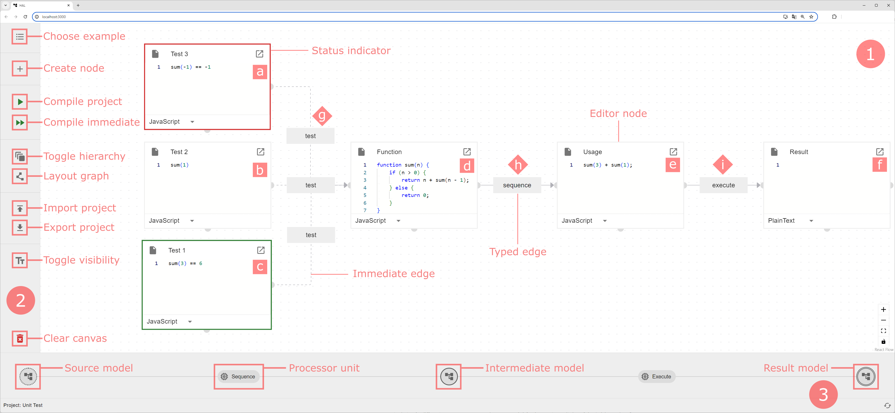
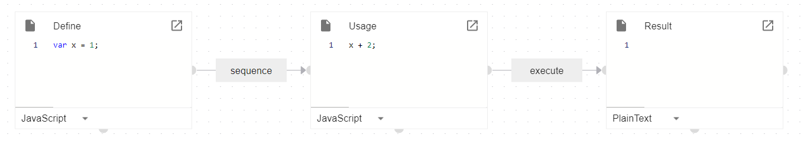
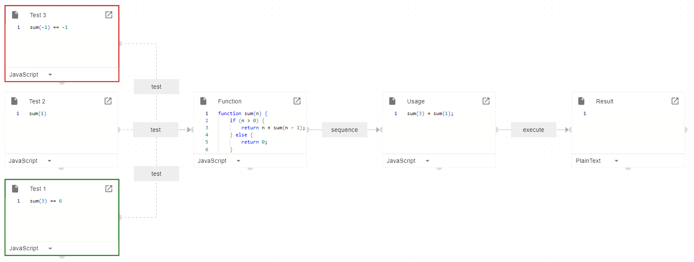
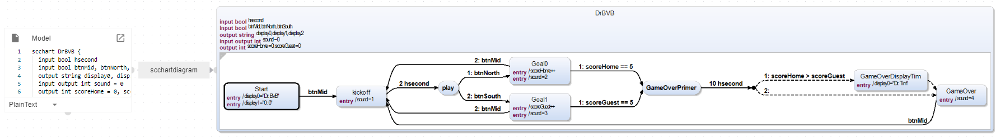
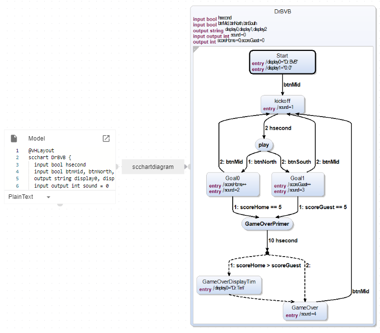
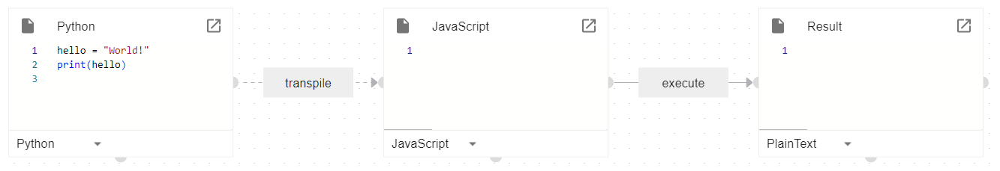
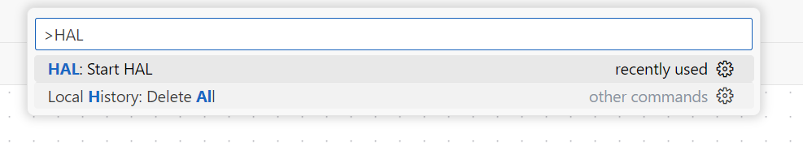
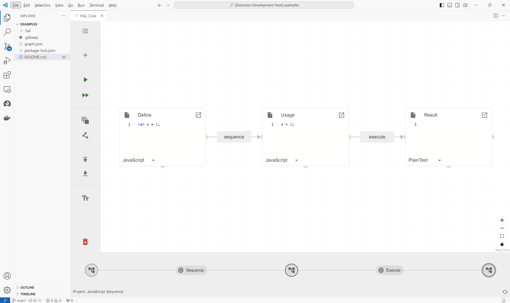
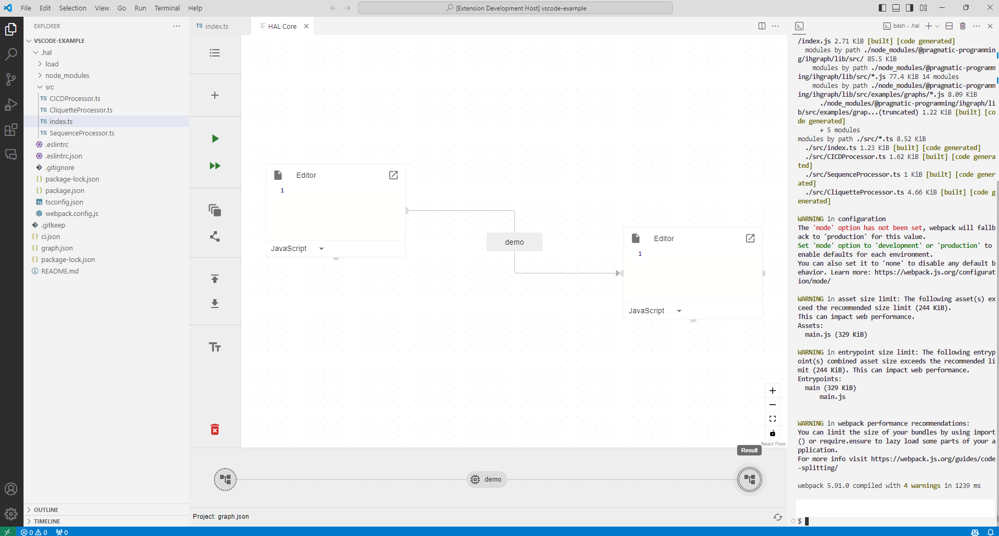

# HAL: Holistic Abstraction Layer

Prototype implementation to "Towards Pragmatic Programming: A Multi-Paradigm Multi-Editor Development Environment"

Anonymized Reviewer Version Only

Dear Reviewer,

as mentioned in the paper, HAL is a prototype implementation using state-of-the-art technologies. 
Unfortunately, we did not manage in time to bundle everything in one easy-to-install Visual Studio Code Extension as planned due to current technical limitations.
We did, however, prepare this repository for you to build the application yourself. 
For this, we prepared several scripts to ease the installation process, but we will also provide the yarn commands if a script should fail.
Since HAL is a web project, the only hard requirement for the build is npm/yarn.
Depending on the depth of your test (w.r.t. compilation unit levels from the paper and customized compilation units), further steps may be necessary. 

  * The tutorial starts with the Web version that shows the fundamentals of the paper and Level 0 compilation units. 
  * It then explains how to build the server (+optional Docker image) for the Level 1 and 2 compilation units. 
  * Finally, the experimental section provides instructions on how to bundle the web application for Visual Studio Code to allow direct implementation of customized compilation units.

We kindly ask you to go through this tutorial step by step to verify our proof-of-concept. 
Please forgive any inconveniences along the way. 
HAL is an experimental, academic project in its early stages. 
However, we believe that the concept offers some powerful modeling possibilities and would very much like to receive your feedback to help steer the project in the right direction.

Thank you very much.

## Pure Web Version of HAL (Level 0)

  * Go to the `./hal/gui/` folder and run `run.sh` (or `.ps1`).
(Alternatively, if the script fails, follow the GUI steps in the [./hal/README.md](./hal/README.md) inside the `./hal` directory.)

After the script has finished, the application should be up and runnning at `http://localhost:3000/hal`.
(Usually, your browser will open up automatically.)

In the application, you should be greeted with the screen that is also included in the paper.

In this state you can compile Level 0 examples, because only compilation units that can run in the browsers can be executed.

##### JavaScript Sequence Example
Choose the  `JavaScript Sequence` example and press `Compile project` (Play cutton).
Afterwards, the compilation view is now populated and can be used to switch between the examples.

##### Unit Test Example
As a second example, load the `Unit Test`. 
This is the example used in the screenshot. 
As soon as you run `Compile immediate` (double Play button) each border of the tests will indicate its status.
You can use the compilation view as before after you compiled normally.

Feel free to draw your own diagram or look at other examples, but please notice that most features are still experimental (and not part of the paper).
You can of course alter the JavaScript and Unit Test examples to see how that would change the compilation.

## Server Support for Level 1 and 2

To try out the example that need server support, you have to prepare the Docker image and run the Springboot server.
To start clean, shut down the application server from the previous example.
If you do not want to install Docker, you can still test the Level 1 example.

* Go to `./hal/docker/` and run `build.sh` (or `.ps1`).

* Then run *both* in seperate shells:
  * `run.sh` (or `run.ps1`) in `./hal/gui/`
  * `run.sh` (or `run.ps1`) in `./hal/server/`

When both have finished loading, open `http://localhost:3000/hal`.
(Again, if one of the scripts fail, consult the [./hal/README.md](./hal/README.md).)
(If you do not have wget installed, the server run.sh will say so. You can try the `getkicodia.sh` script using curl or simply download the `kicodia` version for your OS from https://rtsys.informatik.uni-kiel.de/~kieler/files/release_sccharts_1.3.0/cli/ and put it in the `./hal/server/tmp` directory. `kicodia` will generate the Statecharts diagram in the server.)

##### Level 1 SCCharts Example

**Requirement:** The SpringBoot server must be running and the kicodiag cli must be present in your ./hal/server/tmp directory.

Open the `SCChart` example and press `Compile immediate`.
The status indicator at the bottom right should be spinning because the compilation unit is waiting for the response of the server. 
After a brief period, the SCCharts diagram to the state machine should be drawn on the canvas.

Now, write @VHLayout into the first line of the text editor of the Model and press `Compile immediate` again.
The server should send you a new diagram layouted differently.

Please feel free do edit the SCChart and request a new diagram from the server. 
To edit more comfortable, resize the editor node.

##### Level 2 Python Transpile Example

**Requirement:** The SpringBoot server and Docker must be running.

Open the `Python Transpile` example. 
When you `Compile immediate` the server will transpile your Python code to JavaScript. 
Then, you can `Compile` normally, to execute your generated code in the browser.

# VS Code Extension (EXPERIMENTAL)

We are currently in the process of making HAL available in various IDEs to support the developer directly in the place where they work. 
The VS Code Extension is the first experimental support of this kind and is currently limited to Level 0 examples.
However, unlike the web app, it allows users to define their own processors for transformations and is thus more flexible. 
It will be expanded in the future.

> Note that HAL in its current stage is not optimized for multiple color schemes. For the best experienmce, we recommend running VS Code with the "Light+" or "Light Modern" theme.

## Installation

  * Go to `./vscode-extension/` and run `build.sh` (or `build.ps1`)
  * After the script finishes, open the folder with VS Code via `code .`. This VS Code instance represents the development view of the HAL VS Code extension.
  * Inside VS Code press F5 or click on "Run & Debug" in the sidebar and then "Run Extension" (compare image below) to run a new VS Code instance with the HAL extension running.

.

## Demonstration & Testing

After installing the extension, HAL provides its own view that can be started via the "HAL: Start HAL" command.
Click "Help > Show All Commands" and type "HAL" to find the command or simply open the command prompt with SHFT+STRG+P.

.

You should now see the HAL view, which contains an empty canvas, a sidebar and status bar (compare below image).
In the following image, we have highlighted the buttons to open the menu to show the examples and the button to then compile the graph.

.

Similar as before, the Level 0 examples, JavaScript Sequence and Unit Test, should work out-of-the-box.
After compiling the graph, the status bar in the bottom shows the compilation chain with an immediate and end result.

.

## Custom Compilation Units (Experitmental)

Lastly, we would like to demonstrate the most experimental HAL's features, namely custom compilation units that allow the developer to inject own graph transformations into the abstraction layer.
Please note that this feature will be encapsulated into a more convenient workflow, but as a proof-of-concept we still want to guide you through the process.

### Manual injection of compilation untis

The HAL VS Code extension enables the developer to integrate their own custom compilation unit. 
Therefore, it loads a JS file called `.hal/load/index.js` from the current workspace.

We have prepared an example to exemplify this in the `./vscode-example` folder. 

  * In VS Code with your HAL extension, open the folder. 

It should contain the prepared `.hal/` directory.
In the main workspace, there is a `graph.json` and `ci.json` file, which can both be imported in HAL
as further examples (more on that later).

  * Open a terminal and go to the `.hal` directory. 
  * You need to run `npm install` inside the `.hal/` folder to fetch all dependencies.

To make new compilation units known during the run-time, they must be added to the `.hal/src/index.ts` and packed with webpack. 

  * Whenever a change to `index.ts` (or any other TS file) is made, run `npm run pack` (inside `.hal`) and wait for completion before refreshing the `HAL` view (opened with the `Start HAL`) command.
    * Run `npm run pack` inside `.hal` now.

Any processors registered in the file will immediately be available in HAL.

##### Custom Compilation Unit Example

You can also find a prepared example for this in the `graph.json` file, which can be imported via the *Import* button in the left sidebar.
As example, create two text nodes, connect them with a prototype edge and
set the edge type to `demo`. Upon compilation, the graph will be replaced with a single "Hello, World" node.

You can now open the `.hal/src/index.ts` to edit the `DemoProcessor` class to influence the transformation.
Remember to call `npm run pack` to make the changes visible and reload your HAL view (`Start HAL`).
