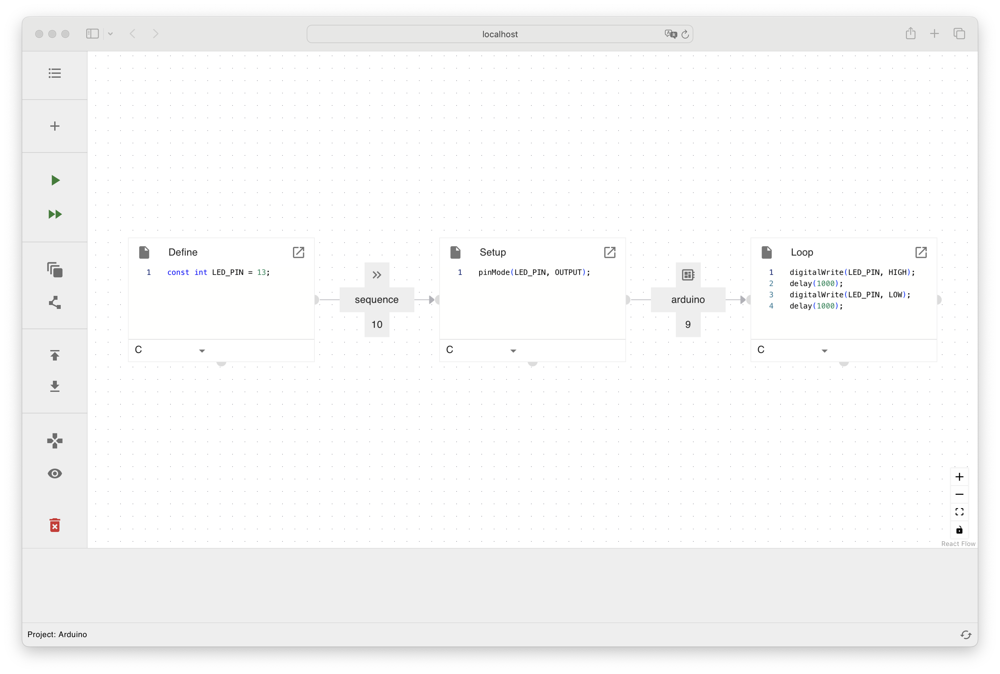

# HAL



## Development

**Gui:**
```sh
cd gui
yarn
# next line is only needed the first time
# and when devDependendy "monaco-editor" is updated
yarn run copy-monaco
yarn run start
# run tests
yarn run test
```

**Docker:**
```sh
cd docker
./build.sh
```

**Server:**
```sh
cd server
./gradlew bootRun
```
